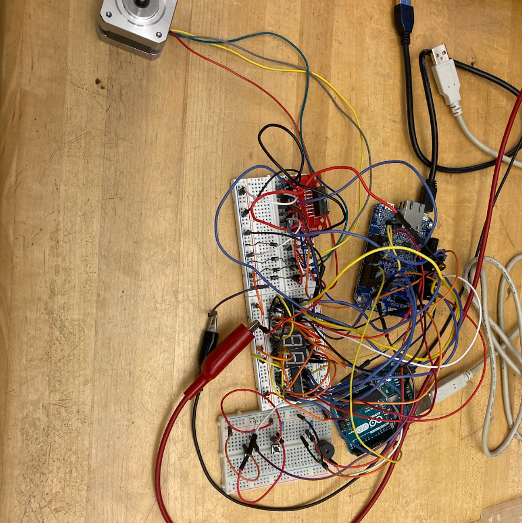

# Stepper Motor Metronome

We designed a digital metronome using GPIO, hardware interrupts, a timer (FTM3), and a stepper motor on a FRDM-K64F microcontroller. The system is controlled by 3 physical buttons wired to interrupts to increase
or decrease the BPM or turn the the motor on/off. 

The circuit also displays the current bpm of the stepper motor metronome using a 7-segment display. 
Arduino is only used for producing the tick sound with a buzzer. 

**[Watch the Demo Video on YouTube](https://youtu.be/edP20gJBEIU)**

## Hardware Diagram

## Software Flowchart

## Setup

## High-Level Software Description

### Timer Module
The timer module is used to generate precise ticks for the metronome. It is configured with a **prescaler of 32** and a **21 MHz clock**, resulting in:
Ticks per second = 21,000,000 / 32 = 656,250 ticks per second.

### Interrupts & Button Debouncing
Interrupts are configured to react to falling edge button input. We implemented a software debounce by adding a delay in the IRQ handler after performing logic, but before clearing the interrupt flag. This solved the unstable, duplicate button presses problem. 

### GPIO & LED Output
GPIO was used to output to the led display with K64F to provide a visual cue.  

## Stepper Motor Control
The FRDM-K64F microcontroller controls a stepper motor that rotates clockwise and counterclockwise using 2-phase-on, full-step mode.

### Counterclockwise Step Sequence

| Step | A1 | A2 | A3 | A4 |
|------|----|----|----|----|
| 0    |    | +  | +  |    |
| 1    | +  |    | +  |    |
| 2    | +  |    |    | +  |
| 3    |    | +  |    | +  |

---

### Clockwise Step Sequence

| Step | A1 | A2 | A3 | A4 |
|------|----|----|----|----|
| 0    |    | +  | +  |    |
| 1    |    | +  |    | +  |
| 2    | +  |    |    | +  |
| 3    | +  |    | +  |    |

Each "+" represents a high signal (logic 1) sent to the corresponding stepper motor input pin. The microcontroller cycles through these steps in the appropriate direction to rotate the motor in sync with the metronome tick.

### Arduino Communication & Buzzer Output
An Arduino is used to generate a beep sound for each tick:
- The K64F sends a digital high signal to an Arduino pin each tick.
- The Arduino detects this signal and outputs a beep through a buzzer.
